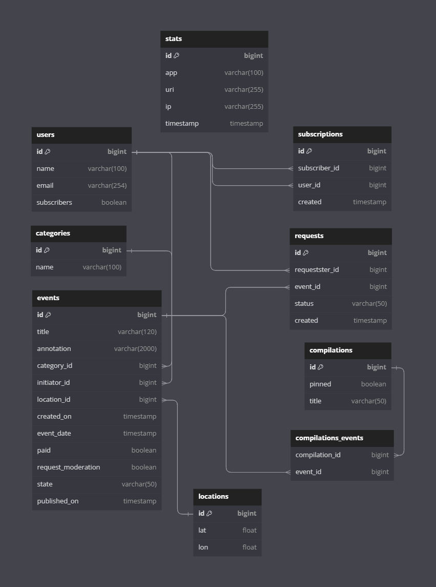

# java-explore-with-me
### **Poster application. In this app you can propose any event from an exhibition to going to the cinema and gather a company to participate in it.**
###
### **The application consists of two microservices:**
### 1. EWM - contains the main application logic to CRUD: users, events, event participation requests, event collections, event categories, user subscriptions.
### 2. Stats - stores the number of unique event views and will allow you to make various samples to analyze the operation of the application. Also contains part of the common DTOs. 

### [**Database schema**] (https://dbdiagram.io/d/EWM-6509bfbe02bd1c4a5edeb6d1)

